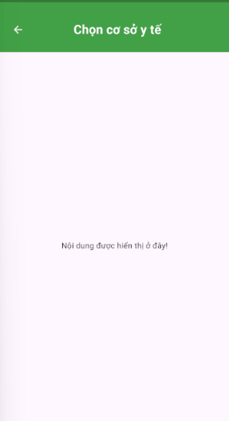

# Hướng Dẫn Sử Dụng WidgetHeaderBody

Hướng dẫn này giải thích cách sử dụng `WidgetHeaderBody` trong dự án Flutter.

## Import

```dart
import 'package:flutter/material.dart';
import 'package:health_care/common/app_colors.dart';
import 'package:health_care/widgets/widget_header_body.dart';
```

## Cách Sử Dụng

### Ví Dụ Cơ Bản

```dart
class ExampleScreen extends StatelessWidget {
  @override
  Widget build(BuildContext context) {
    return WidgetHeaderBody(
      title: 'Tiêu Đề Ví Dụ',
      body: Center(
        child: Text('Nội dung được hiển thị ở đây!'),
      ),
      headerHeight: 0.15, // Tuỳ chọn: Điều chỉnh chiều cao header theo phần trăm
      onBackPressed: () {
        print('Nút quay lại được bấm');
        Navigator.of(context).pop();
      },
    );
  }
}
```

### Kết Quả

Dưới đây là hình ảnh minh hoạ giao diện được tạo từ ví dụ trên:



## Tham Số

| Tham Số         | Kiểu Dữ Liệu  | Mặc Định | Mô Tả                                             |
|-----------------|---------------|----------|---------------------------------------------------|
| `title`         | `String`      | -        | Văn bản tiêu đề của header.                      |
| `body`          | `Widget`      | -        | Widget hiển thị nội dung bên dưới header.        |
| `headerHeight`  | `double`      | `0.15`   | Chiều cao header theo phần trăm chiều cao màn hình. |
| `onBackPressed` | `VoidCallback?`| `null`   | Hàm được gọi khi nút quay lại được bấm.          |

## Tuỳ Chỉnh Giao Diện

- **Màu nền của Header:** Được đặt qua `AppColors.accent`.
- **Kiểu chữ:** Được định dạng với chữ trắng, in đậm và kích thước 22.
